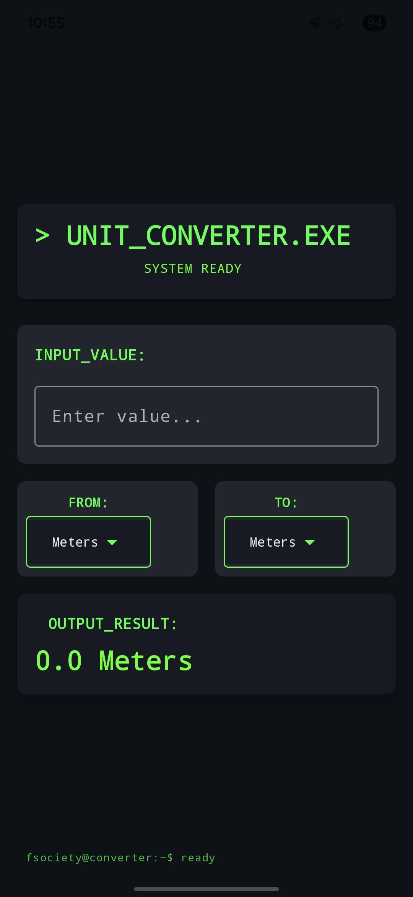

# 🧮 Unit Converter - Android Jetpack Compose (MR. ROBOT Style)

A simple and stylish unit converter Android application built using **Jetpack Compose** with a dark, hacker-themed UI inspired by the MR. ROBOT series.

## ✨ Features

- 🔁 Convert between different length units:
  - Meters
  - Centimeters
  - Millimeters
  - Feet
- 🔥 Real-time conversion as you type
- 🎨 MR. ROBOT dark mode styling with red/white/black color scheme
- 💻 Hacker-style interface using monospaced fonts
- 💡 Built with **Jetpack Compose** and **Material3**

## 📸 Screenshots

## 🛠️ Tech Stack

- Kotlin
- Android Jetpack Compose
- Material3 Design Components
- Jetpack Activity & Scaffold

